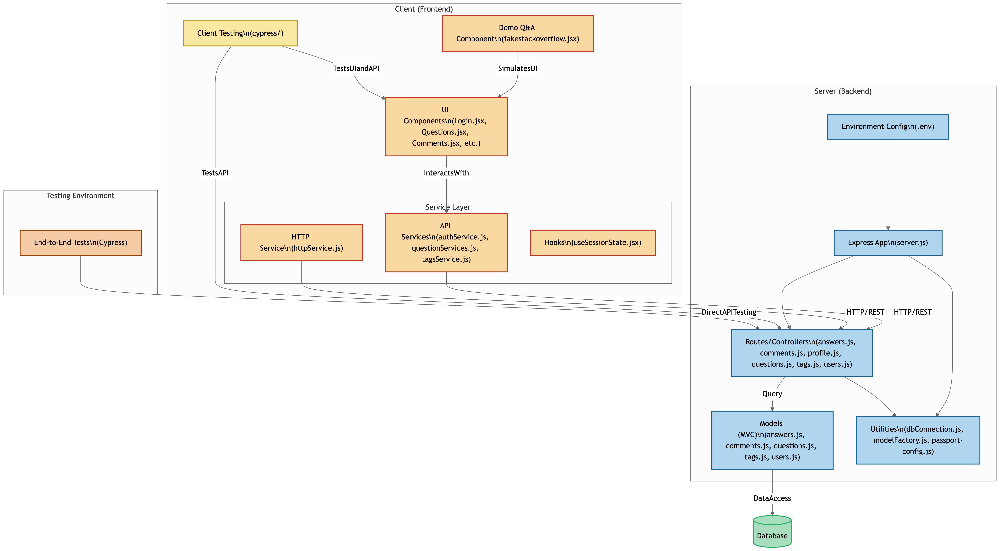

# 💬 STACK OVERFLOW CLONE

A full-stack Q&A web application modeled after Stack Overflow. Built using **React** on the client-side and **Node.js with Express** on the server-side, this project supports user authentication, question posting, commenting, and voting, along with end-to-end testing using **Cypress**.

---

## 🧠 SYSTEM ARCHITECTURE

This application is divided into three main environments:

- **Client (Frontend)** — built with React  
- **Server (Backend)** — built with Express and Node.js
- **Database (Database)** — built with MongoDB   
- **Testing Environment** — end-to-end testing using Cypress

### 🗺️ Architecture Diagram

---

## ✅ FEATURES

### Core Functionality

- ✅ User registration and authentication (Passport.js + Sessions)
- ✅ Ask, answer, and comment on questions
- ✅ Tag-based filtering
- ✅ Upvote/Downvote system
- ✅ End-to-end testing with Cypress

### Technology Stack

| Layer     | Tech                          |
|-----------|-------------------------------|
| Frontend  | React, Axios, Hooks           |
| Backend   | Node.js, Express, Passport.js |
| Database  | MongoDB                       |
| Testing   | Cypress                       |

---

## 📁 PROJECT STRUCTURE

### 🔹 Client (Frontend)

- [UI Components](https://github.com/akshat151/stack_overflow_clone/tree/main/client/src/components/)
- [API Services](https://github.com/akshat151/stack_overflow_clone/tree/main/client/src/services/ApiServices/)
- [HTTP Service](https://github.com/akshat151/stack_overflow_clone/blob/main/client/src/services/httpServices/httpService.js)
- [Hooks (useSessionState)](https://github.com/akshat151/stack_overflow_clone/blob/main/client/src/hooks/useSessionState.jsx)
- [Demo Component](https://github.com/akshat151/stack_overflow_clone/blob/main/client/src/components/fakestackoverflow.jsx)
- [Client Tests (Cypress)](https://github.com/akshat151/stack_overflow_clone/tree/main/client/cypress/)

### 🔹 Server (Backend)

- [Express App (server.js)](https://github.com/akshat151/stack_overflow_clone/blob/main/server/server.js)
- [Routes / Controllers](https://github.com/akshat151/stack_overflow_clone/tree/main/server/routes/)
- [Models (MVC)](https://github.com/akshat151/stack_overflow_clone/tree/main/server/models/)
- [Utilities](https://github.com/akshat151/stack_overflow_clone/tree/main/server/utils/)
- [.env](https://github.com/akshat151/stack_overflow_clone/blob/main/server/.env)

### 🔹 Testing

- [Cypress Server-Side Tests](https://github.com/akshat151/stack_overflow_clone/tree/main/testing/)

---

## 🧪 TESTING

This project uses **Cypress** to test frontend functionality, routing logic, and backend integration:

Sure! Here’s the pure Markdown code for that section:

---

## 🧭 GETTING STARTED

### 🔧 LOCAL DEPLOYMENT

1. **Clone the repository**

   git clone https://github.com/akshat151/stack_overflow_clone.git
   cd stack_overflow_clone

2.	Backend setup
   cd server
   npm install
   npm start

3.	Frontend setup
    cd client
    npm install
    npm start

4.	Visit the app

---

☁️ CLOUD DEPLOYMENT (OPTIONAL)

🔹 Render (Full Stack Deployment)
	1.	Connect your GitHub repo to Render
	2.	Create a Web Service:
	•	Root directory: server
	•	Start command: npm start
	•	Set environment variables: MONGODB_URI, SESSION_SECRET, etc.
	3.	Create a Static Site:
	•	Root directory: client
	•	Build command: npm run build
	•	Publish directory: build

🔹 Vercel (Frontend Only)
	1.	Connect your repo and select the client/ folder
	2.	Set:
	•	Build command: npm run build
	•	Output directory: build

🔹 Railway / Heroku (Backend Only)
	1.	Create a new project
	2.	Set environment variables
	3.	Point root to the server/ directory
	4.	Confirm auto-deploy or manually deploy

---

📚 LICENSE

This project is licensed under the MIT License. See the LICENSE file for more details.

---
🙌 CREDITS

Created by Akshat with ❤️ for learning, collaboration, and fun!

